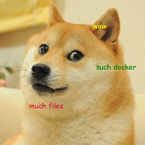

Dogen [dodʒen]
==============

This is a simple tool to generate `Dockerfile` files from YAML templates.

Usage
-----

This tool is shipped as a Docker image registered as :code:`jboss/dogen`.
You can see the :code:`Dockerfile` for this image in the main directory
of the source distribution. This Docker image uses some conventions:

1. The **image template** that should be converted into :code:`Dockerfile` is expected to be
   available at :code:`/input/image.yaml`.
2. The output directory will be :code:`/output`.
3. The directory with (optional) scripts should be available at :code:`/scripts`.

Considering above you need to remember to mount appropriate volumes at the container
start. You are free to change the paths, but please remember to provide new locations
as part of the container's :code:`run` command instruction.

Examples
~~~~~~~~

Assuming your current working directory contains your :code:`image.yaml` file, any scripts
your :code:`image.yaml` references are in an adjacent subdirectory called :code:`scripts` and you
want the output written to an adjacent sub-directory named :code:`out`:

    docker run -it --rm -v $(pwd):/tmp:z dogen:latest --verbose /tmp/image.yaml /tmp/out
