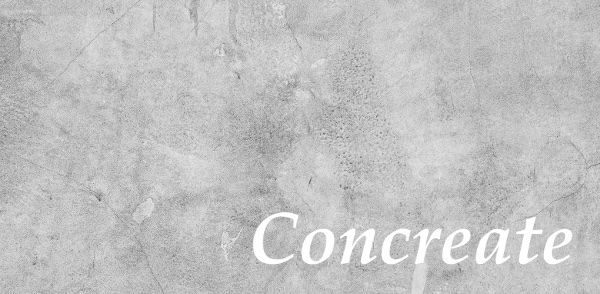

Concreate
=========

About
-----

Container image creation tool.

Concreate helps to build container images from image definition files.

Features
--------

- Building container images from YAML image definitions
- (not yet available) Running tests on built images
- (not yet available) Releasing container image by building it in Red Hat supported build system

Status
------

This project is currently in development. Initial release should be available shortly. Support for multiple target platforms is planned in future, but currently only Docker is supported.

Installation
------------

Please refer to `documentation <http://concreate.readthedocs.io/en/develop/installation.html>`_.

Requirements
^^^^^^^^^^^^

To build container images you need to have Docker installed on your system.

Usage
-----

Please refer to the ``concreate --help`` output.

Documentation
-------------

`Documentation is available here <http://concreate.readthedocs.io/en/develop/>`_.

History
-------

Concreate originates from the `Dogen <https://github.com/jboss-dockerfiles/dogen>`_ tool. Dogen was developed for over two years and served us well, but we decided to make it a first class citizen and promote using abstract image descriptors. At the same time we wanted to add new set of features which made the "Dockerfile generator" tagline inaccurate and we decided to start fresh under a new project. In any case, this is the Dogen project evolution.

